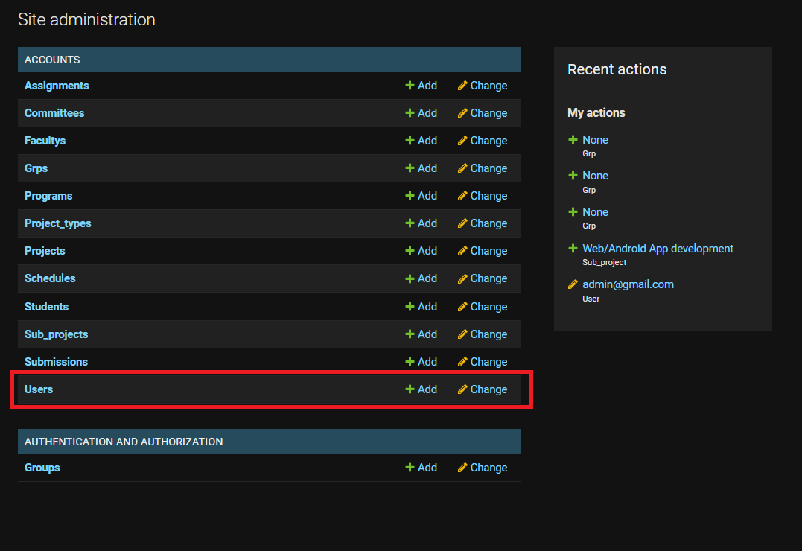
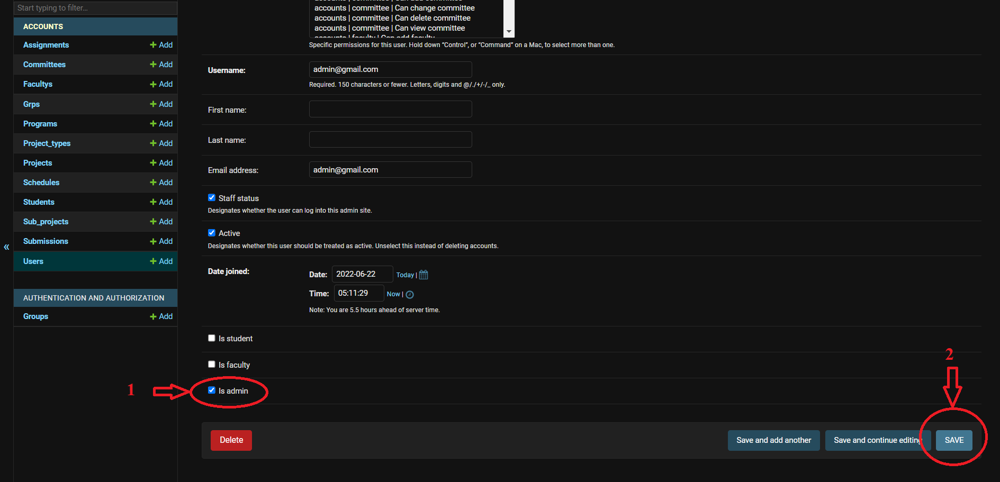
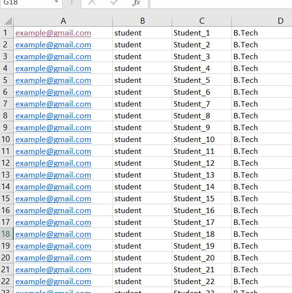
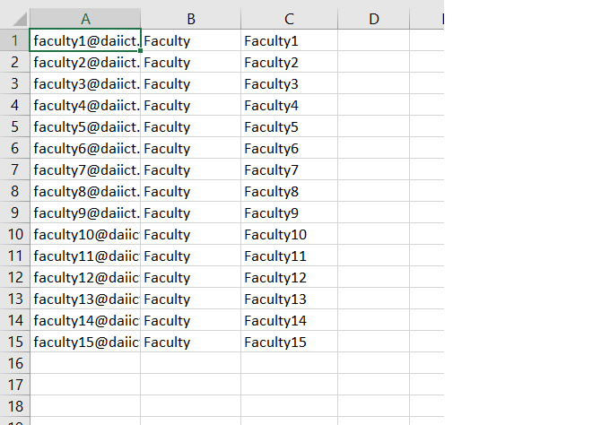

# SPMES - Students' Project Management and Evaluation System


## Installation
Since this project was created using a Linux system, it is recommended to run it on Linux.

To run this project on a local server, clone this repository or download a zip file on your PC.
Clone the project on a local PC:
```bash
  git clone https://github.com/Dhruvin-Moradiya/spmes.git
```

Now you need to download the requirements on your PC. To do so, first, open the terminal and change the directory to the folder which contains this project.
```bash
$ cd path/spmes
```
```
Username: example@gmail.com
email: example@gmail.com
```
Run the command given below to download requirements.
```bash
$ pip install -r requirements.txt
or
$ pip3 install -r requirements.txt
```
Now you need to create a superuser. While creating supper user, make sure that username and email are the same.
```bash
$ python3 manage.py createsuperuser
```

Now, you can run this project using the command given below.
```bash
$ python3 manage.py runserver
```
The local server will be running on
```bash
http://127.0.0.1:8000/
```


## Usage/Examples

To use this project first, we need to create an admin user.

First goto Djangos' admin panale.
- http://127.0.0.1:8000/admin
Enter the username and password which you have created in the installation section.

Go into the user's model. Displayed below. 


Open your Superuser object and mark the checkbox of IsAdmin, as shown in the image below. Save the object and close the tab.


Now are super user is admin. 
- http://127.0.0.1:8000/
log in on the web portal using the same username and password as the superuser.


Students and Faculties can be added using format given below.



